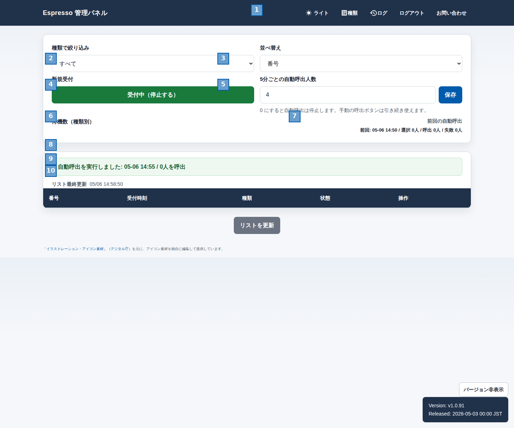

## 管理パネル 画面設計書

### 1. 概要
- 目的：予約の状況を把握し、受付制御および自動呼出設定を実行する管理画面。
- 対象ユーザー：管理者。
- 前提条件：ログイン状態で表示される。予約データが存在することが前提だが、初期表示では空の可能性がある。
- 主要ユースケース：
  - 予約を種類で絞り込み、状態で並べ替えて一覧を確認する。
  - 新規受付の制御（受付中 / 受付停止）を切り替える。
  - 5分ごとの自動呼出人数を設定する。

### 2. 画面レイアウト
<!-- フルスクショ上に正方形項番を付与したレイアウト図 -->

### 3. 画面項目
| 項番 | 項目名 | 種別 | 表示/入力 | 必須 | 型/形式 | 桁 | 初期値 | 入力規則 | 備考 |
|---:|---|---|---|:--:|---|---:|---|---|---|
| 1 | ナビゲーションバー | ヘッダー | 表示 | - | - | - | - | 常に表示。テーマ切替、種類、ログ、ログアウト、お問い合わせボタンを含む。 | ダークカラー背景 |
| 2 | 種類で絞り込み | ドロップダウン | 入力 | - | 選択肢 | - | すべて | 「すべて」を含む種類一覧から選択。選択時に画面が更新される。 | 左側の検索条件パネル |
| 3 | 並べ替え | ドロップダウン | 入力 | - | 選択肢 | - | 番号 | 「番号」「状態」「種類」から選択。選択時に一覧が並び替わる。 | 右側の検索条件パネル |
| 4 | 新規受付 | ボタン | 操作 | - | - | - | 受付中 | 押下で受付を開始/停止する。確認ダイアログが表示される。 | ボタン色で状態を示す（緑=受付中、赤=受付停止） |
| 5 | 5分ごとの自動呼出人数 | テキスト入力 + ボタン | 入力 | - | 数値 | 1〜3 | 4 | 0〜50の範囲で入力可能。0で自動呼出停止。「保存」ボタンで送信。 | ヘルパーテキスト付き。手動呼出は引き続き使用可。 |
| 6 | 待機数（種類別） | テキスト | 表示 | - | テキスト | - | 種類別バッジ | 各種類ごとの待機中の予約数を表示。 | バッジ形式 |
| 7 | 前回の自動呼出 | テキスト | 表示 | - | テキスト | - | 呼出情報 | 最後に実行した自動呼出の日時と対象者数を表示。 | 右側サマリーパネル |
| 8 | 自動呼出実行メッセージ | テキスト | 表示 | - | テキスト | - | なし | 自動呼出が実行されたときの結果メッセージを表示。初期表示では空欄。 | グリーンアラート形式 |
| 9 | リスト最終更新 | テキスト | 表示 | - | タイムスタンプ | - | 読み込み中... | 予約一覧の最後の更新日時をリアルタイム表示。 | メタ情報 |
| 10 | 予約一覧テーブル | テーブル | 表示 | - | 複数行 | - | 空欄 | 番号、受付時刻、種類、状態、操作列を持つテーブル。スクロール表示。 | ヘッダーは固定。各行に操作ボタン。 |

### 4. 操作・イベント
| 画面項番 | 操作 | トリガー | 条件 | 処理内容 | 成功時 | 失敗時 |
|---|---|---|---|---|---|---|
| 2 | 種類で絞り込み | ドロップダウン選択 | - | 選択された種類でフィルタリング。画面を自動更新。 | 絞り込み結果が表示される。ドロップダウンの選択値が保持される。 | なし。 |
| 3 | 並べ替え | ドロップダウン選択 | - | 選択されたキー（番号/状態/種類）で一覧を再ソート。 | 一覧が並び替わる。 | なし。 |
| 4 | 新規受付切り替え | ボタン押下 | - | 確認ダイアログを表示。受付状態を開始/停止に切り替える。 | ボタンの色とラベルが切り替わる。管理者ログに記録される。 | キャンセルで操作なし。サーバーエラーで失敗メッセージ。 |
| 5 | 自動呼出人数設定 | 入力 + 保存ボタン | 0〜50の数値 | 入力値を送信し、次回以降の自動呼出時に適用。 | 設定が保存される。確認メッセージまたはトースト表示。 | 無効な値でバリデーションエラー表示。 |
| 8 | 自動呼出実行 | システム定期実行 | スケジュール時刻 | 設定された人数分の予約を呼出。結果メッセージを表示。 | メッセージが「自動呼出を実行しました: 〇〇人を呼出」と表示される。 | 予約なしで「対象がありません」メッセージ。 |
| 10 | 予約一覧の更新 | リスト最終更新ボタン / 定期自動更新 | - | 予約データをサーバーから再取得。テーブルを更新。 | テーブルが最新データで更新される。タイムスタンプが更新される。 | サーバーエラーで警告メッセージ。 |

### 5. 補足
- 権限/ロール：管理者専用。監査管理者は別画面（ログイン履歴画面）へ遷移する。
- 性能/制約：予約一覧は最大100件まで表示。スクロール可能。定期自動更新は約30秒単位。
- 要確認事項：自動呼出のスケジュール時刻の詳細仕様確認が必要。
