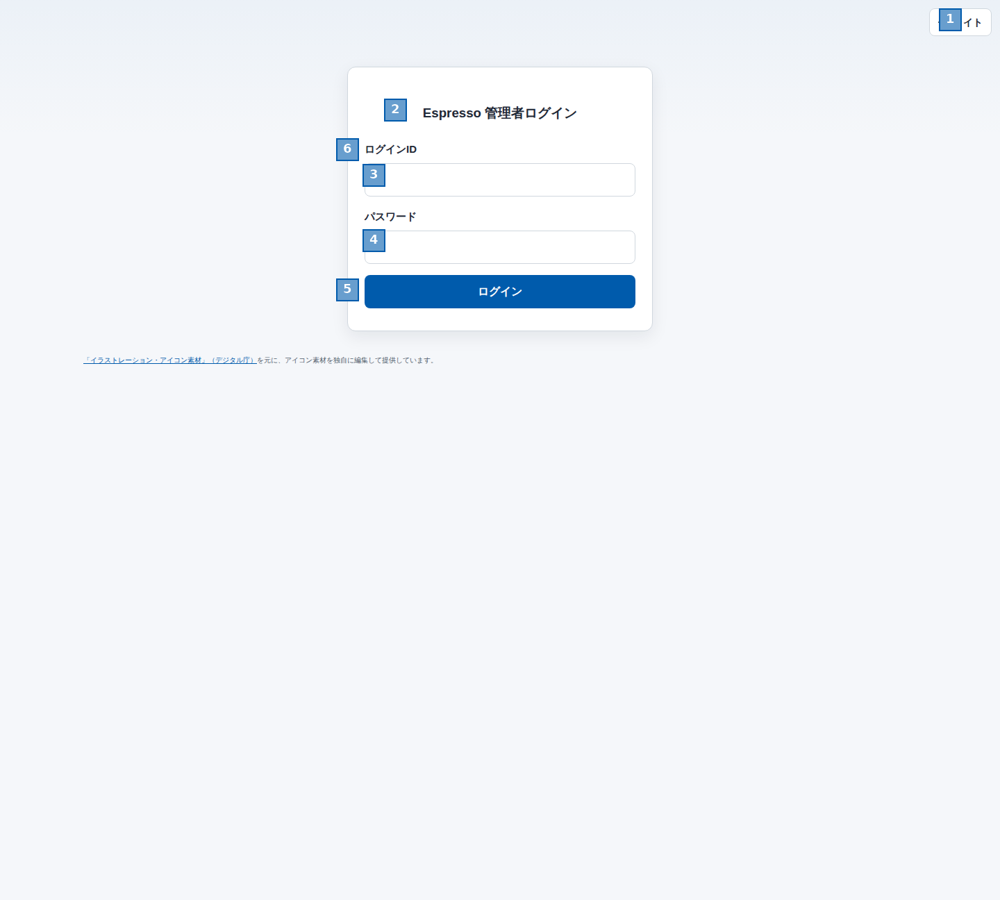

## 管理者ログイン 画面設計書

### 1. 概要
- 目的：管理者がログインし、管理機能へ遷移するための画面。
- 対象ユーザー：管理者、監査管理者。
- 前提条件：未ログイン状態で表示される。ログインIDとパスワードの組み合わせが有効であること。CSRFトークンがセッションに付与されていること。
- 主要ユースケース：
  - ログインIDとパスワードを入力してログインする。
  - 認証失敗時にエラーメッセージを確認する。
  - テーマを切り替える。

### 2. 画面レイアウト
<!-- フルスクショ上に正方形項番を付与したレイアウト図 -->

### 3. 画面項目
| 項番 | 項目名 | 種別 | 表示/入力 | 必須 | 型/形式 | 桁 | 初期値 | 入力規則 | 備考 |
|---:|---|---|---|:--:|---|---:|---|---|---|
| 1 | テーマ切替 | ボタン | 操作 | - | - | - | ライト | 押下するとライト/ダークを切り替える。状態は `espresso-theme` に保存される。 | アイコンとラベルが切り替わる |
| 2 | 画面タイトル | テキスト | 表示 | - | 文字列 | - | 管理者ログイン | 変更不可。 | 見出し表示 |
| 3 | ログインID | テキスト入力 | 入力 | 必須 | 半角英小文字・数字・`_`・`-` | 3〜32 | 空欄 | 前後空白は除去され、小文字化して送信される。サーバー側で形式チェックされる。 | `required` 指定あり |
| 4 | パスワード | パスワード入力 | 入力 | 必須 | 文字列 | - | 空欄 | 未入力不可。伏字で入力する。 | `required` 指定あり |
| 5 | ログイン | ボタン | 操作 | - | - | - | ログイン | 押下で認証を実行する。 | フォーム送信ボタン |
| 6 | エラーメッセージ | テキスト | 表示 | - | 文字列 | - | 非表示 | 認証失敗時のみ表示する。 | 失敗時は `パスワードが正しくありません` |

### 4. 操作・イベント
| 画面項番 | 操作 | トリガー | 条件 | 処理内容 | 成功時 | 失敗時 |
|---|---|---|---|---|---|---|
| 1 | テーマ切替 | ボタン押下 | 画面表示中 | ライト/ダークを切り替え、選択状態を `localStorage` に保存する。 | ボタンのラベルとアイコンが切り替わる。 | 保存に失敗しても表示は継続する。 |
| 3 | ログインID入力 | テキスト入力 | フォーカス時 | ログインIDを入力する。送信時に前後空白を除去し、小文字化する。 | 入力値が保持される。 | なし。 |
| 4 | パスワード入力 | テキスト入力 | フォーカス時 | パスワードを入力する。表示は伏字とする。 | 入力値が保持される。 | なし。 |
| 5 | ログイン | ボタン押下、Enterキー | ログインID・パスワード・CSRFトークンが送信可能 | 認証処理を実行し、管理者セッションを開始する。認証成功時は操作ログを記録する。 | 管理者は管理画面へ遷移する。監査管理者はログイン履歴画面へ遷移する。 | 認証失敗時は画面を再表示し、エラーメッセージを表示する。IP単位の失敗回数が上限に達している場合は 429 を返す。 |
| 6 | エラーメッセージ表示 | 認証失敗 | 認証結果が不正 | エラー内容を表示する。 | `パスワードが正しくありません` を表示する。 | レート制限時はこのメッセージは出ず、429 となる。 |

### 5. 補足
- 権限/ロール：未ログインユーザー向け。認証成功後は管理者ロールに応じて遷移先が分岐する。
- 性能/制約：ログインIDは `^[a-z0-9][a-z0-9_-]{2,31}$` を満たす必要がある。ログイン失敗は IP 単位で 300 秒あたり 10 回を超えると 429 となる。
- 要確認事項：なし。